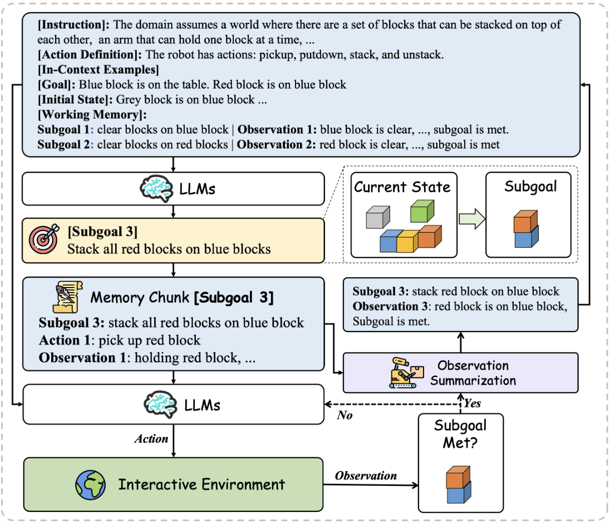

<div align="center">
<h1> HiAgent: Hierarchical Working Memory Management for Solving Long-Horizon Agent Tasks with Large Language Model
 </h1>
</div>

## 📖 Overview

HiAgent is a novel hierarchical working memory management framework for solving long-horizon agent tasks with large language models (LLMs). It introduces a hierarchical memory structure that helps LLMs better organize and utilize information during complex task solving.

Key features:
- 🧠 Hierarchical memory management with working memory and long-term memory
- 🎯 Effective for long-horizon tasks requiring multi-step planning
- 🔄 Dynamic memory updating and pruning mechanisms
- 📝 Structured memory format for better information organization
- 🤖 Compatible with various LLM backends

<div align="center">

</div>

## 🤝 Special Thanks

We build this repo based on [AgentBoard](https://github.com/hkust-nlp/AgentBoard/tree/main/agentboard) project. We would like to thank the authors for their excellent work.

## 🚀 Quick Start

### 🛠️ Build from source

- Clone this repo

- Create and activate virtual environment 🐍
```shell
conda create -n hiagent python=3.8.18
conda activate hiagent
```

- Setup [AgentBoard](https://github.com/hkust-nlp/AgentBoard/tree/main/agentboard) environment and data 📥

### 🔑 Setup environment

Before starting, please make sure you have configured <a href="https://developer.nvidia.com/cuda-toolkit">cuda</a>. If not, please configure it first.

If configured, you can check using the following commands:

- Check version information 📊
```shell
nvcc -V
```

### 🛠️ Additional Setup

- Download nltk library by running the following code: 📚
```python
import nltk
nltk.download('punkt')
nltk.download('punkt_tab')
```

- Create and configure ```./agentboard/.env``` file, Environment Variables needed include: ⚡

```
PROJECT_PATH=
OPENAI_API_KEY=
```

### 🏃 Run script

If the configuration is correct and the code runs successfully, you should see a series of prompts in the terminal.
```shell
bash evaluate_model.sh
```


### 📊 Visualize results

<div align="center">

</div>
